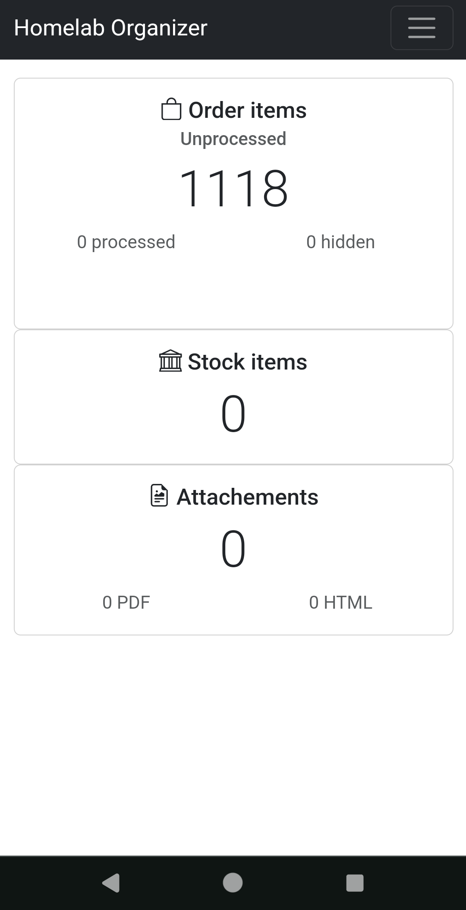
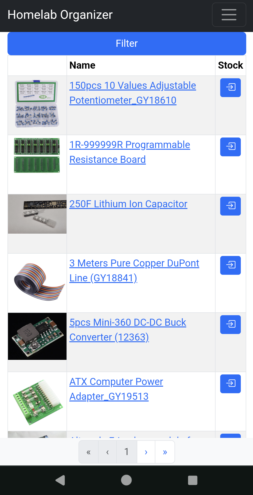
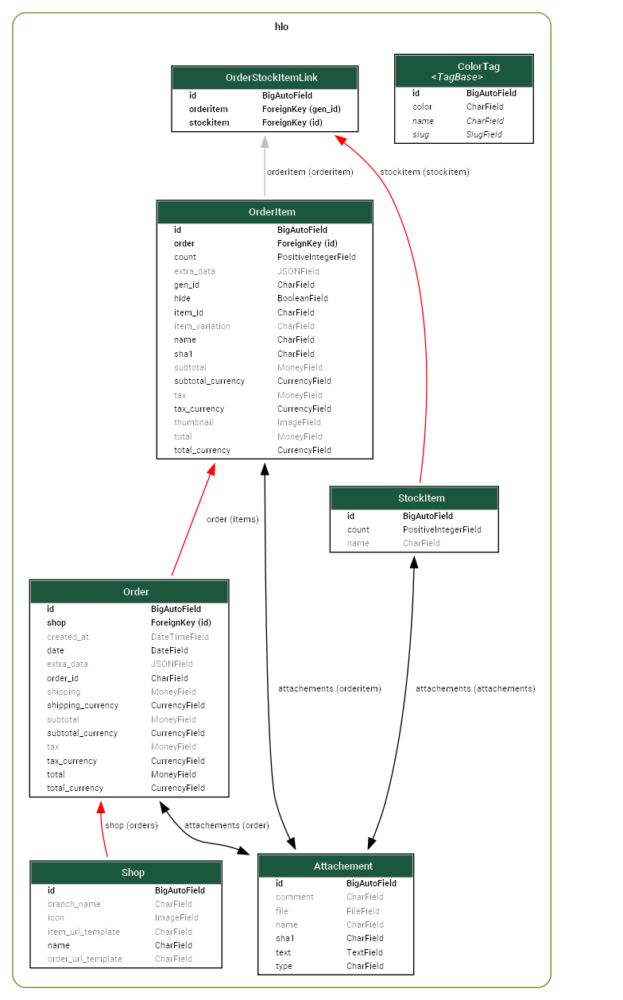

# homelab-organizer

Web app for organizing stuff in your homelab. Slow progress, primary focus is still [Webshop Scraper](https://gitlab.com/Kagee/webshop-order-scraper) for input data.

This project used to contain [Webshop Scraper](https://gitlab.com/Kagee/webshop-order-scraper) before the code became to big.

<!-- markdownlint-capture -->
<!-- markdownlint-disable MD033 -->
<table>
<tr><td colspan="2">Mobile screenshots</td><tr>
<tr><td>



</td>
<td>


</td></tr>
</table>
<!-- markdownlint-restore -->

## Requirements

Python 3.10 or later. Should support  Linux/Mac OS X/Windows.

## Linux 101

````python
cd /some/folder
git clone https://gitlab.com/Kagee/homelab-organizer
cd homelab-organizer
cp example.env .env
nano .env # Edit .env to your liking
python update.py
````

## Windows 101

````bash
cd /some/folder
git clone https://gitlab.com/Kagee/homelab-organizer # or Github Desktop/other
cd homelab-organizer
cp example.env .env
notepad .env # Edit .env to your liking
python update.py
````

## (Possibly outdated) model graph



## Some of the direct external packages used

* __Haystack__ provides modular search for Django - haystack
  * <https://django-haystack.readthedocs.io/>
* __Django REST framework__ is a powerful and flexible toolkit for building Web APIs - rest_framework
  * <https://www.django-rest-framework.org/>
* __Django-filter__ allows users to filter down a queryset based on a
  model’s fields and displaying the form to let them do this - django_filters
  * <https://django-filter.readthedocs.io>
* __Django Extensions__ is a collection of custom extensions for the Django Framework. These include management commands, additional database fields, admin extensions and much more. - django_extensions
  * <https://django-extensions.readthedocs.io/>
* __django-taggit__ is a reusable Django application designed to make adding tagging to your project easy and fun. - taggit
  * <https://django-taggit.readthedocs.io/>
* __Bootstrap 5 for Django__. Seamlessly blends Django and Bootstrap 5 - django_bootstrap5
  * <https://django-bootstrap5.readthedocs.io/>
* __django-bootstrap-icons__. Easy Bootstrap Material Design icons - django_bootstrap_icons
  * <https://github.com/christianwgd/django-bootstrap-icons>
    * <https://icons.getbootstrap.com/>
    * <https://fonts.google.com/icons>

## Some of the indirect external packages used

* __Whoosh__ search and indexing - used by Haystack
  * <https://whoosh.readthedocs.io>
* __pygraphviz__. Used by Django Extensions.
  * <https://pygraphviz.github.io/documentation/stable/install.html#windows>

## Inspirations

* <https://www.partkeepr.org/>
* <https://github.com/replaysMike/Binner>
* <https://partsbin.page/screenshots>
* <https://partsbox.com/>
* <https://demo.part-db.de/en/>
* <https://bomist.com/>

## Acknowledgements

For steadfast bug fixing, having orders that totally scramble my scraping, and coming up with those excellent ideas when I have been struggling with a bug for an hour.
<!-- markdownlint-capture -->
<!-- markdownlint-disable MD033 -->
<table>
<tr><td>

[  
neslekkim](https://github.com/neslekkim)
</td>
<td>

[  
rkarlsba](https://github.com/rkarlsba)
</td></tr>
</table>
<!-- markdownlint-restore -->

## Notes and ideas

* <https://rk.edu.pl/en/fulltext-search-sqlite-and-django-app/>
